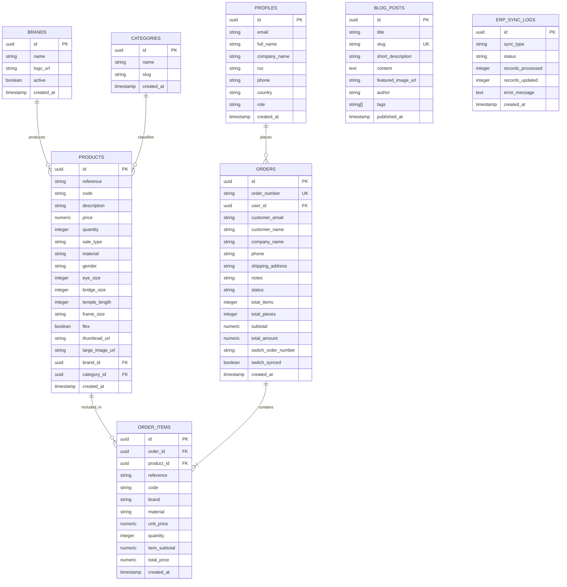

# DUBROS EYEWEAR — DATABASE SCHEMA & RELATIONAL ERD

Este documento detalla la estructura completa de la base de datos alojada en **Supabase (PostgreSQL 15)** que da soporte a Dubros Eyewear B2B.

---

## 1. Diagrama Entidad-Relación (Mermaid ERD)

---

## 2. Diccionario de Datos por Tabla

### 2.1. `products` (Catálogo Maestro de Artículos)
Contiene las más de 5,440 referencias ópticas sincronizadas con Switch ERP.

| Columna | Tipo | Nulo | Descripción |
|---|---|---|---|
| `id` | `UUID` | NO | Llave primaria (`gen_random_uuid()`) |
| `reference` | `VARCHAR(100)` | NO | Modelo óptico (ej. `PRESTIGE211221`, `MAR-GEL220805`) |
| `code` | `VARCHAR(100)` | NO | Código de barras o SKU Switch ERP |
| `description` | `TEXT` | SÍ | Descripción técnica de la montura o accesorio |
| `price` | `NUMERIC(10,2)` | NO | **Precio unitario por pieza física** en USD |
| `quantity` | `INTEGER` | NO | Stock físico disponible en bodega Zona Libre |
| `sale_type` | `VARCHAR(20)` | NO | `'PIEZA'` o `'DOCENA'` (define regla de cobro en frontend) |
| `material` | `VARCHAR(50)` | SÍ | Acetato, Metal, TR-90, Titanio, etc. |
| `gender` | `VARCHAR(20)` | SÍ | Hombre, Mujer, Unisex, Niños |
| `eye_size` | `INTEGER` | SÍ | Calibre (Boxing ISO 8624) en mm (ej. 54) |
| `bridge_size` | `INTEGER` | SÍ | Puente nasal en mm (ej. 19) |
| `temple_length` | `INTEGER` | SÍ | Longitud de varilla en mm (ej. 145) |
| `frame_size` | `VARCHAR(30)` | SÍ | Formato combinado Boxing (ej. `54-19-145`) |
| `flex` | `BOOLEAN` | SÍ | Bisagras flexibles con resorte (`true` / `false`) |
| `thumbnail_url` | `TEXT` | SÍ | URL de imagen miniatura |
| `large_image_url` | `TEXT` | SÍ | URL de imagen alta resolución con zoom |
| `brand_id` | `UUID` | SÍ | Llave foránea a `brands.id` |
| `category_id` | `UUID` | SÍ | Llave foránea a `categories.id` |

### 2.2. `orders` (Encabezados de Pedidos)
| Columna | Tipo | Nulo | Descripción |
|---|---|---|---|
| `id` | `UUID` | NO | Llave primaria |
| `order_number` | `VARCHAR(50)` | NO | Código único (ej. `DB-260914-4821`) |
| `user_id` | `UUID` | NO | Llave foránea a `profiles.id` |
| `customer_email`| `VARCHAR(255)`| NO | Correo del comprador mayorista |
| `company_name` | `VARCHAR(255)`| SÍ | Razón social de la óptica o distribuidora |
| `total_items` | `INTEGER` | NO | Cantidad de paquetes/unidades de compra en carrito |
| `total_pieces`| `INTEGER` | NO | Total de piezas físicas reales (docenas multiplicadas x12) |
| `subtotal` | `NUMERIC(10,2)`| NO | Total monetario calculado en USD |
| `status` | `VARCHAR(30)` | NO | `'Pendiente'`, `'En Proceso'`, `'Completada'`, `'Cancelada'` |
| `switch_order_number` | `VARCHAR(50)` | SÍ | Número de orden generado al sincronizar con Switch ERP |

### 2.3. `order_items` (Líneas de Detalle de Pedido)
| Columna | Tipo | Nulo | Descripción |
|---|---|---|---|
| `id` | `UUID` | NO | Llave primaria |
| `order_id` | `UUID` | NO | Llave foránea a `orders.id` (ON DELETE CASCADE) |
| `product_id` | `UUID` | SÍ | Llave foránea a `products.id` |
| `reference` | `VARCHAR(100)` | NO | Modelo del producto ordenado |
| `code` | `VARCHAR(100)` | NO | Código Switch ERP |
| `unit_price` | `NUMERIC(10,2)` | NO | Precio unitario facturado (x12 si fue docena) |
| `quantity` | `INTEGER` | NO | Unidades ordenadas por el cliente |
| `item_subtotal` | `NUMERIC(10,2)` | NO | `unit_price * quantity` |
